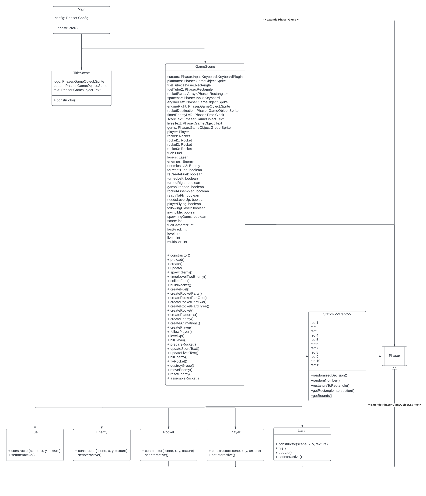

# Start document

### Name: Stefan Pronchev

### Student number: 4670876

#### Problem Description

The student was assigned the task to remake ZX Spectrum Jetpac in JavaScript. Jetpac is a shooter video game developed and published by Ultimate Play the Game and released for the ZX Spectrum and Commodore VIC-20 in 1983 and the BBC Micro in 1984.

The game world is presented in a horizontal wraparound and consists of three platforms which Jetman can manoeuvre onto. Jetman must assemble his rocket (which spawns in pieces scattered around the map), and then fill it with fuel before taking off to the next planet, where the procedure is broadly repeated with alternate procedures. In addition, the player has to defend themselves from the planet's aliens, and for bonus points collect valuable resources which occasionally fall from above.

After the first level, the rocket stays assembled and just requires refuelling. However, every four levels, the rocket resets (giving the player an extra life) and the replacement has to be built before it can be refuelled for takeoff. Each new model has a new design with a higher number written on it, although the core gameplay remains unchanged. The enemies change forms each level (cycling back to the first after eight levels) and each alien has a different pattern of movement which means they can be dealt with in a different manner

The remake version of the original game differs a little bit in one area from the original. There are infinite number of levels and complexity grows significantly (enemy movement pattern changes) on every even level excluding level one.

#### Classes

- Main
- GameScene
- TitleScene
- Enemy
- Fuel
- Laser
- Player
- Rocket
- Platform
- Gem
- Statics (Utility)

#### Input & Output

GameScene Class Inputs

| Case     | Type                                         | Conditions                                   |
| -------- | -------------------------------------------- | -------------------------------------------- |
| Enemy    | `Object of Enemy`                            | has to be `Phaser.GameObject.Sprite`         |
| Rocket   | `Object of Rocket`                           | has to be  `Phaser.GameObject.Sprite`        |
| Laser    | `Object of Laser`                            | has to be `Phaser.GameObject.Sprite`         |
| Player   | `Object of Player`                           | has to be `Phaser.GameObject.Sprite`         |
| Fuel     | `Object of Fuel`                             | has to be `Phaser.GameObject.Sprite`         |
| Platform | `Object of Platform`                         | has to be `Phaser.GameObject.Sprite`         |
| Gems     | `Object of Gem`                              | has to be `Phaser.GameObject.Sprite`         |
| Cursors  | `Object of Phaser.GameObject.Keyboard.Input` | has to be `Phaser.GameObject.Keyboard.Input` |

GameScene Class Outputs

| Case                            | Type       |
| ------------------------------- | ---------- |
| Create Player                   | `function` |
| Create Enemy                    | `function` |
| Create Rocket                   | `function` |
| Create Lasers                   | `function` |
| Create Platforms                | `function` |
| Create Fuel                     | `function` |
| Spawning gems                   | `function` |
| Adding enemies dynamically      | `function` |
| Creating different rocket parts | `function` |
| Collecting fuel                 | `function` |
| Building the Rocket             | `function` |
| Enemies following player        | `function` |
| Level up                        | `function` |
| Game over                       | `function` |
| Game freeze                     | `function` |
| Enemy hitting Player            | `function` |
| Preparing rocket to take off    | `function` |
| Updating lives                  | `function` |
| Updating score                  | `function` |
| Player hitting Enemy            | `function` |
| Rocket take off                 | `function` |
| Moving enemy dynamically        | `function` |
| Reset enemy position            | `function` |
| Assembling rocket parts         | `function` |

### Test Plan

In this section random test case will be described to test and assess the game functionality.

#### Test case

| Step | Input                             | Action                               | Output                                                  |
| ---- | --------------------------------- | ------------------------------------ | ------------------------------------------------------- |
| 1    | Create Player                     | `createPlayer()`                     | `Phaser.GameObject.Sprite`                              |
| 2    | Create Enemies                    | `createEnemy()`                      | `Array<Phaser.GameObject.Sprite`                        |
| 3    | Create Platforms                  | `createPlatforms()`                  | `Phaser.GameObject.Sprite`                              |
| 4    | Create Gems                       | `createGems()`                       | `Array<Phaser.GameObject.Sprite>`                       |
| 5    | Spawn enemies                     | `resetEnemy()` `moveEnemy()`         | `void`                                                  |
| 5    | Spawn gems                        | `spawnGems()`                        | `void`                                                  |
| 6    | Move Player                       | `playerMovement()` `update()`        | `void`                                                  |
| 7    | Player firing lasers              | `fire()`                             | `void`                                                  |
| 8    | Player hits Enemy with laser      | `hitEnemy()`                         | `Object Enemy destroyed from scene` `Score increased`   |
| 9    |                                   | `resetEnemy(); moveEnemy()`          | `Respawn killed Enemy object`                           |
| 11   | Player collects gems              | `colliderPlayerWithGem()`            | `Score increased`                                       |
| 12   | Player collects rocket parts      | `collideRocketWithPlayer()`          | `Rocket part attached to Player body`                   |
| 13   | Player building rocket            | `buildRocket()`                      | `Building rocket parts accordingly`                     |
| 14   | Player collecting fuel for rocket | `collectFuel()`                      | `Fuel attached to Player body`                          |
| 15   | Player fills rocket with fuel 5x  | `collidePlayerWithFuelTube()`        | `Fuel fills Rocket`                                     |
| 16   | Rocket is ready to takeoff        | `assembleRocket()` `prepareRocket()` | `Creating full Rocket object from all gathered parts`   |
| 17   | Player gets inside the rocket     | `flyRocket()`                        | `Rocket moving to the top and back again to the bottom` |
| 18   |                                   | `levelUp()`                          | `Player goes one level up`                              |
| 19   | Enemy hits Player 3x              | `hitPlayer()`                        | `Player health goes one down`                           |
| 20   |                                   | `gameStop()` `gameFreeze()`          |                                                         |

### UML Diagram

